Í þessari æfingu þurftum við að gera Simon Says leik. Fyrst hönnuðum við kassana okkar og skreyttum þá. 
Kennarinn prentaði kassa og við gátum einbeitt okkur að tæknilegum þætti. Fyrst gerðum við Simon Says leik á brauðborði með settunum okkar frá bókasafninu.
Síðan þegar við vissum hvernig allt myndi virka byrjuðum við að búa til okkar eigin vír og brauðborð.
Við tengdum allt saman. Hnappar, brauðborð, hátalari, rafhlaða, arduino og vír. Til að tengja þá notuðum við aðallega lóðajárn.
Og þegar allt var tengt settum við kassann saman með öllu og leikurinn var góður að fara.

Max Maciej

hér eru myndirnar
## Ljósmynd af samsetningu frumgerðar (brauðbretti, takkar, vírar o.s.frv.).
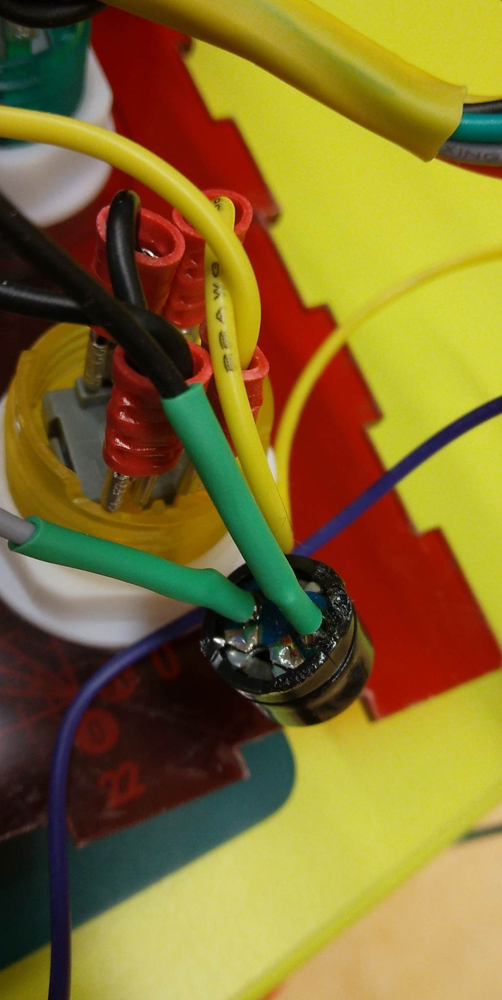 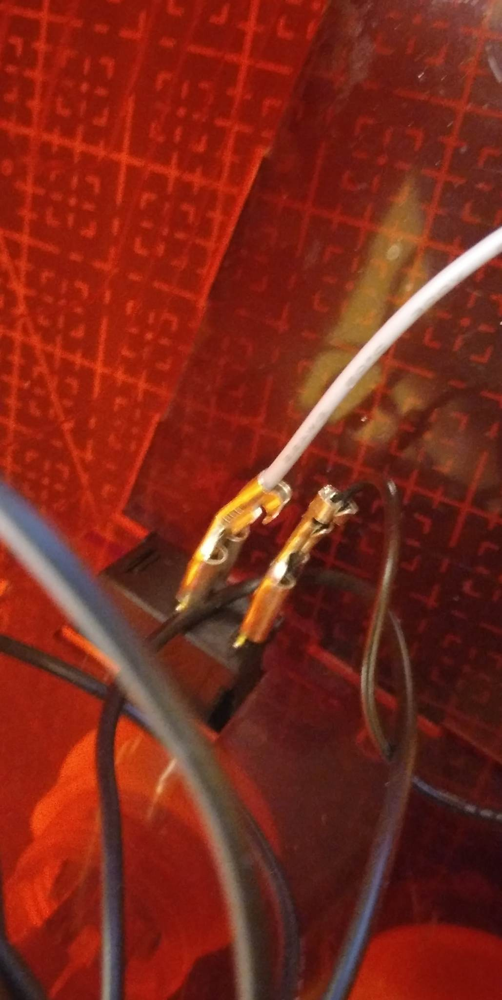 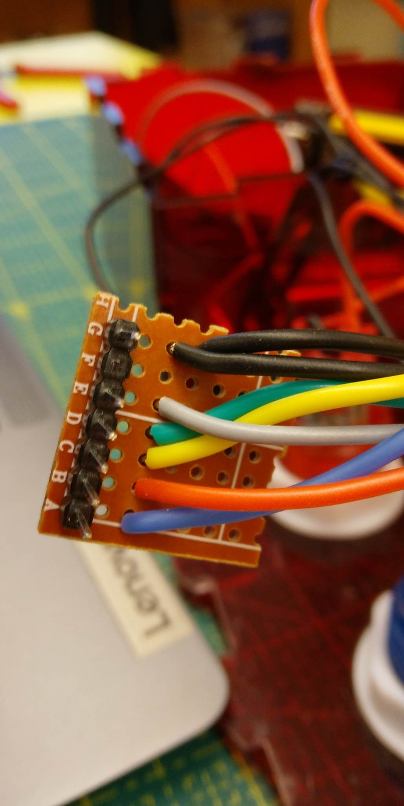
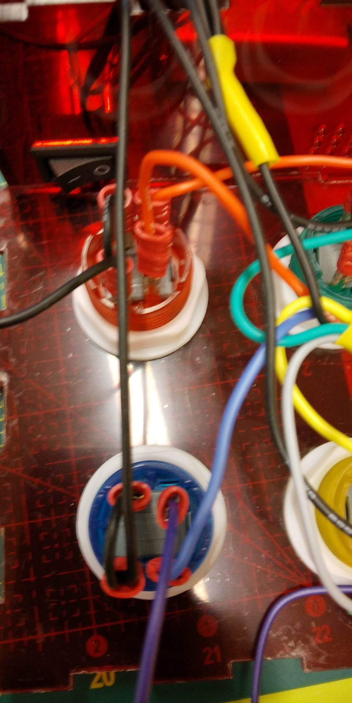 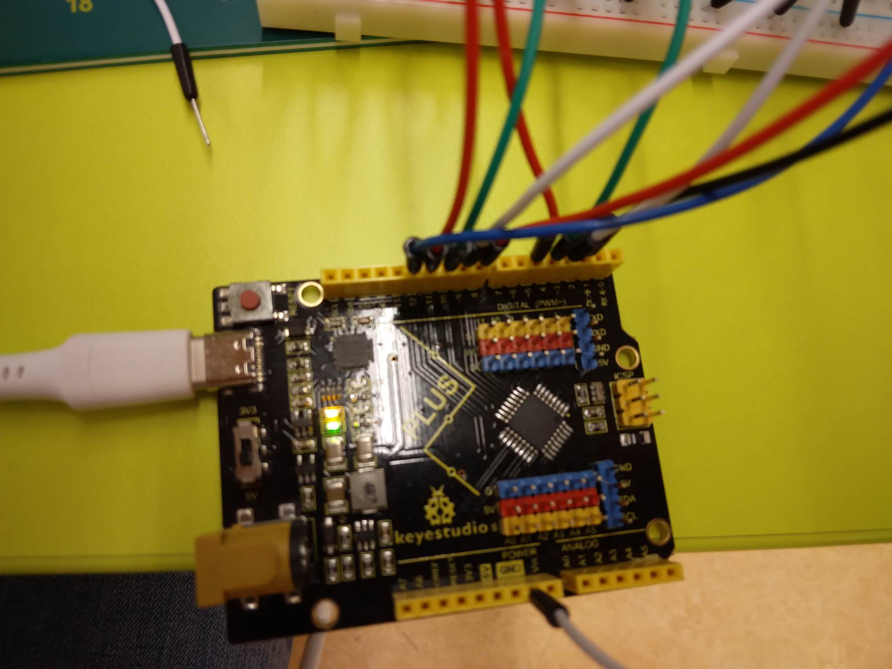 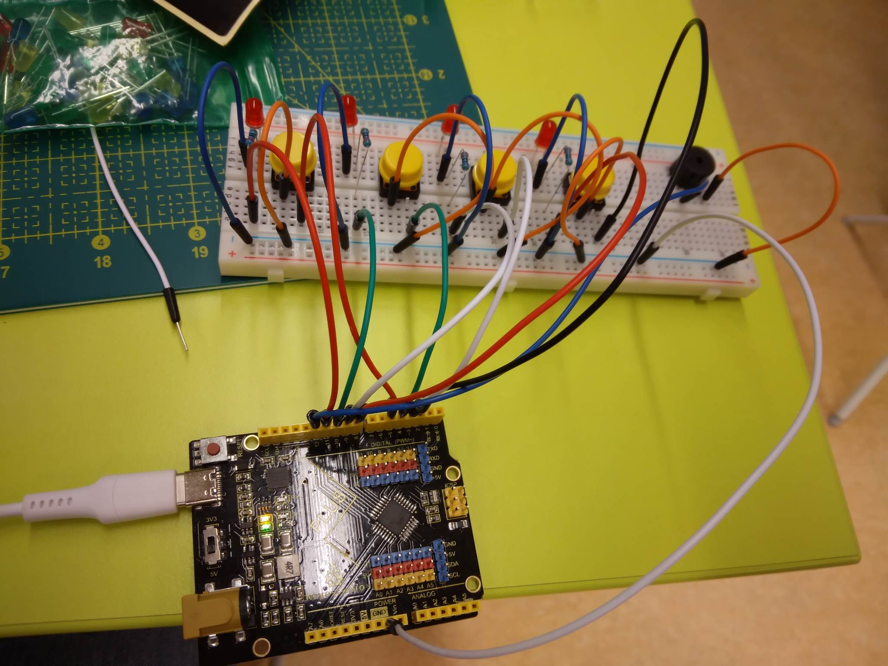
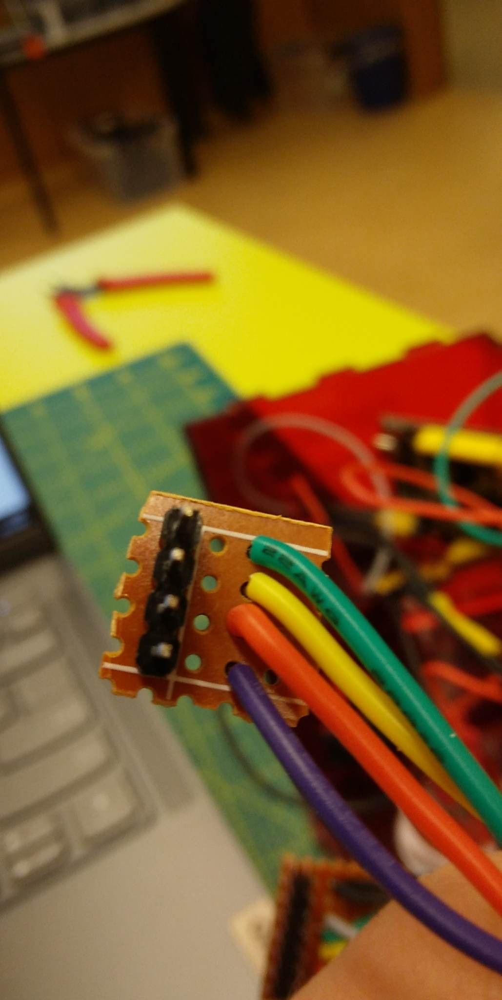 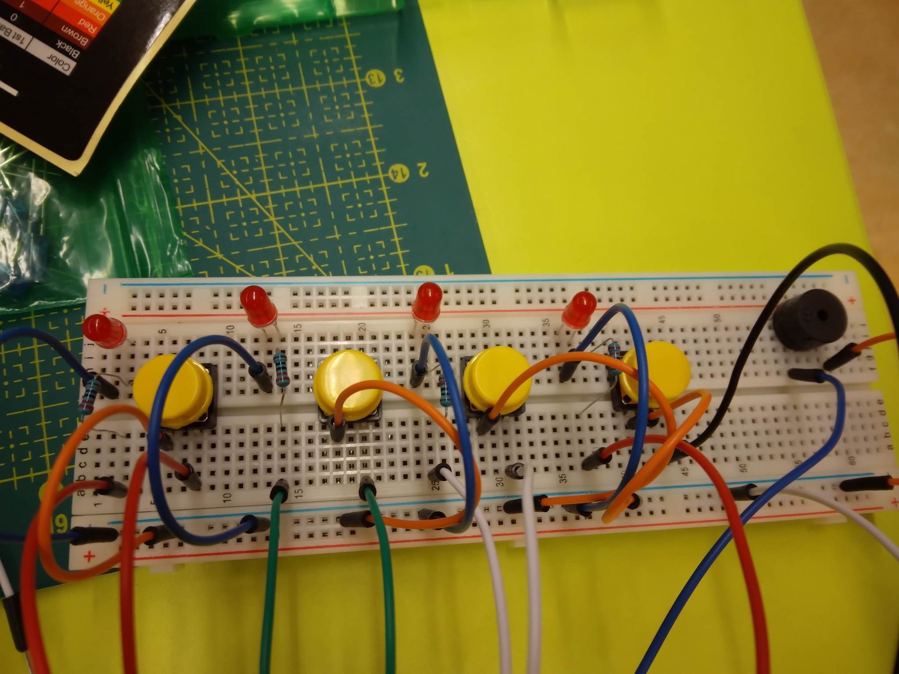 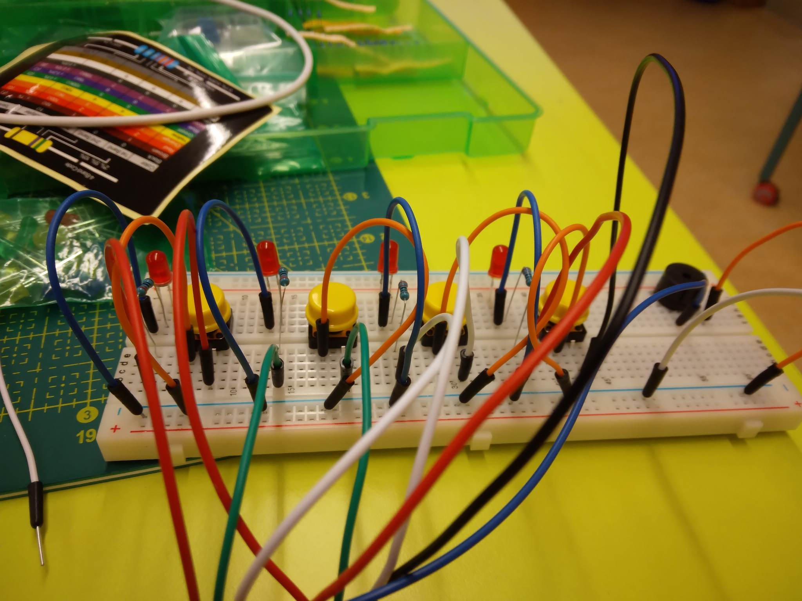
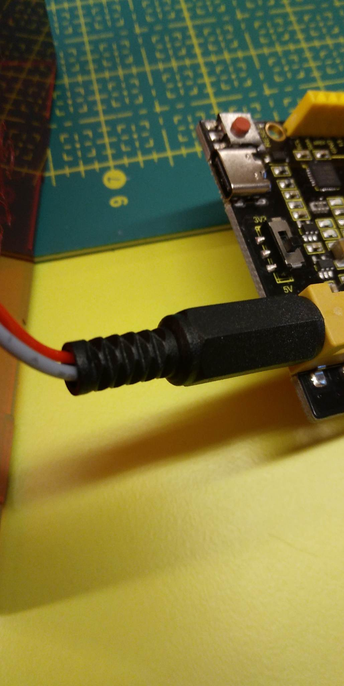 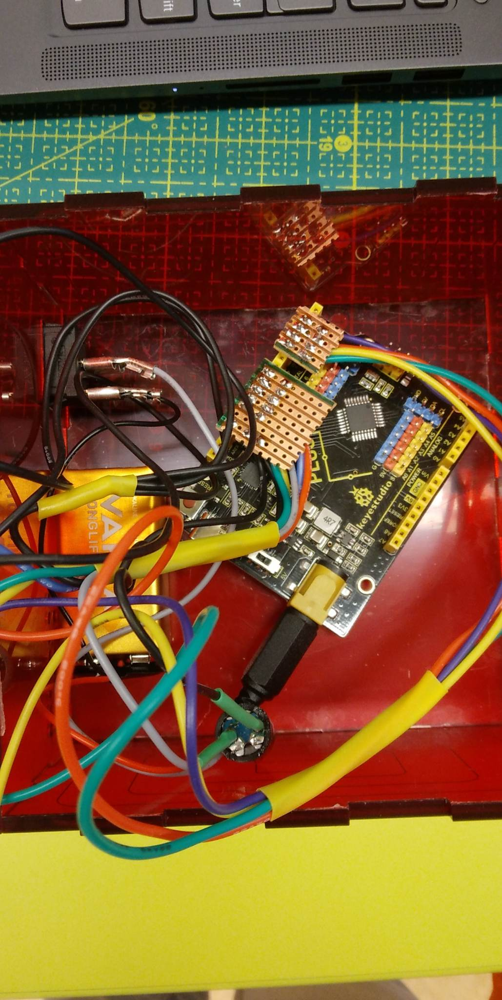
## Ljósmyndir af lokaafurð (inní kassa og utan):
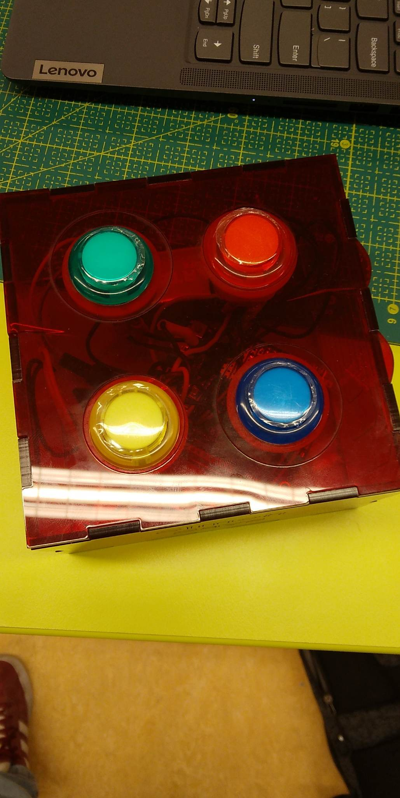 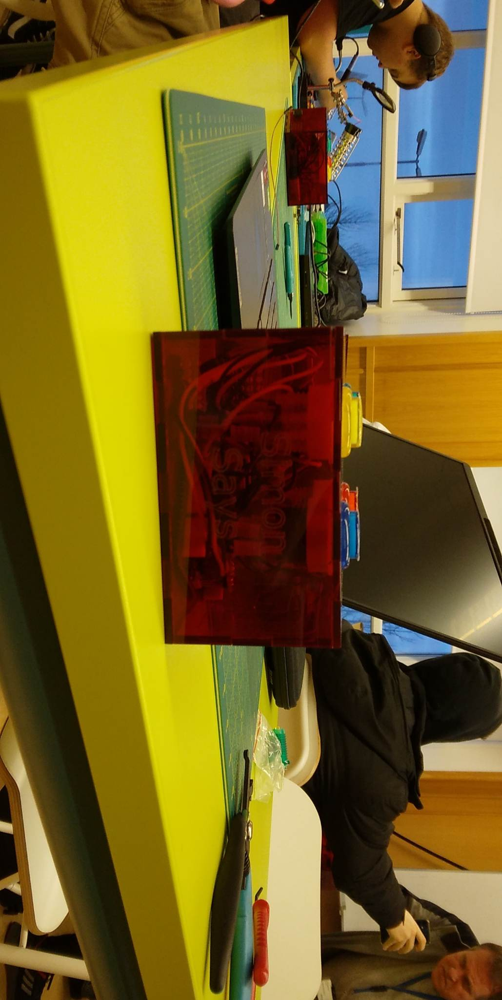 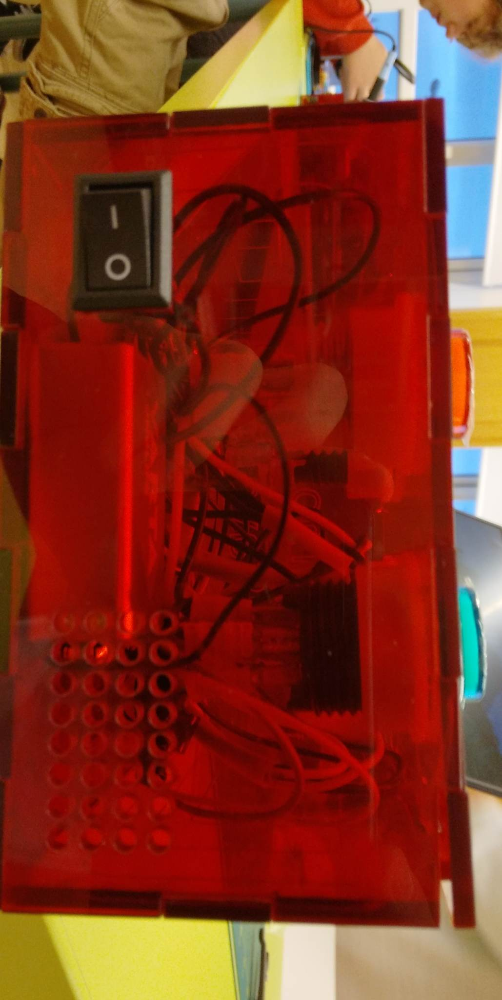
## Ljósmyndir af lóðun (báðar hliðar):
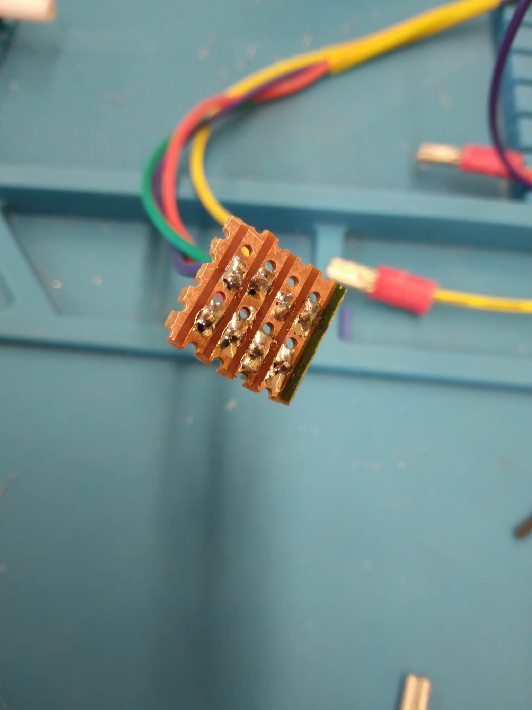 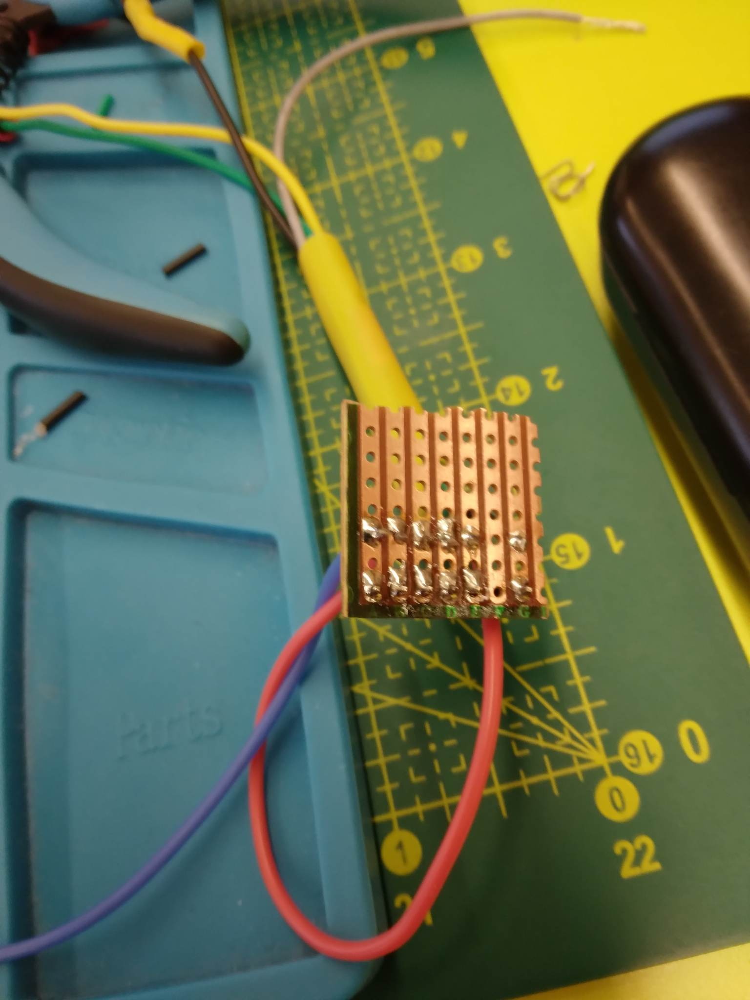 
